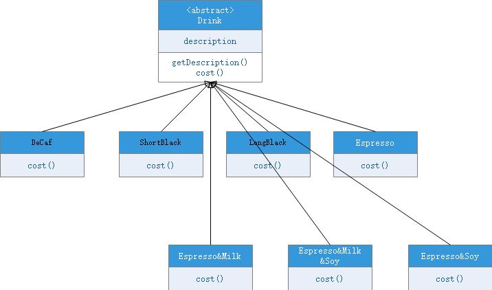
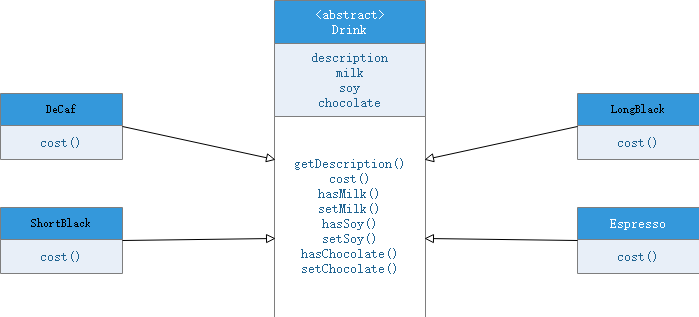
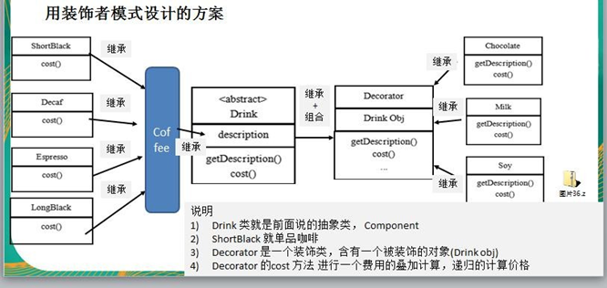

# 装饰者模式

### 星巴克咖啡订单项目（咖啡馆）

1. 咖啡种类/单品咖啡：Espresso(意大利浓咖啡)、ShortBlack、LongBlack(美式咖啡)、Decaf(无因咖啡)

2. 调料：Milk、Soy(豆浆)、Chocolate

3. 要求在扩展新的咖啡种类时，具有良好的扩展性、改动方便、维护方便

4. 使用 OO 的来计算不同种类咖啡的费用: 客户可以点单品咖啡，也可以单品咖啡+调料组合。

   

### 方案一

#### 分析

1. Drink 是一个抽象类，表示饮料

2. des 就是对咖啡的描述, 比如咖啡的名字

3. cost() 方法就是计算费用，Drink 类中做成一个抽象方法.

4. Decaf 就是单品咖啡， 继承 Drink, 并实现 cost

5. Espress && Milk 就是单品咖啡+调料， 这个组合很多

* 问题：这样设计，会有很多类，当我们增加一个单品咖啡，或者一个新的调料，类的数量就会倍增，就会出现类爆炸

### 方案二

前面分析到方案 1 因为咖啡单品+调料组合会造成类的倍增，因此可以做改进，将调料内置到 Drink 类，这样就不会造成类数量过多。从而提高项目的维护性(如图)

#### 分析

1. 方案 2 可以控制类的数量，不至于造成很多的类

2. 在增加或者删除调料种类时，代码的维护量很大
3. 考虑到用户可以添加多份 调料时，可以将 hasMilk 返回一个对应 int

* 考虑使用装饰者模式

### 装饰者模式定义

装饰者模式：动态的将新功能附加到对象上。在对象功能扩展方面，它比继承更有弹性，装饰者模式也体现了开闭原则**(ocp**)

### 装饰者的角色

1. 抽象构件角色(Component):给出一个抽象接口,以规范准备接受附加责任的对象

2. 具体构件角色(Concrete Component):定义将要接受附加责任的类

3. 装饰角色(Decorator):持有一个构件(Component)对象的引用,并定义一个与抽象接口一致的接口

4. 具体装饰角色(Concrete Decorator):负责给构件对象添加附加的责任

     

   ### 装饰者模式解决星巴克咖啡订单      

   

   ### 装饰者模式下的订单：2 份巧克力+一份牛奶的 LongBlack

    